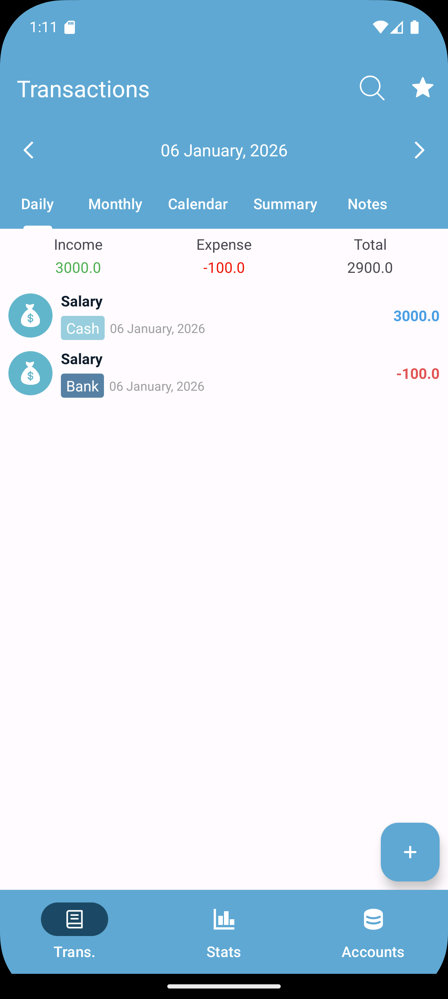

# Expense Manager App 📱

A simple Android Expense Manager application built using Java and Realm database.

## Features
- Add income and expenses
- Daily and monthly transaction tracking
- Category-wise statistics
- Clean UI

## Tech Stack
- Java
- Android SDK
- MVVM Architecture
- Realm Database

## Screenshots

### Home Screen

### Add Transaction

### Statistics

## Developer
Ahmad Ur Rahman
